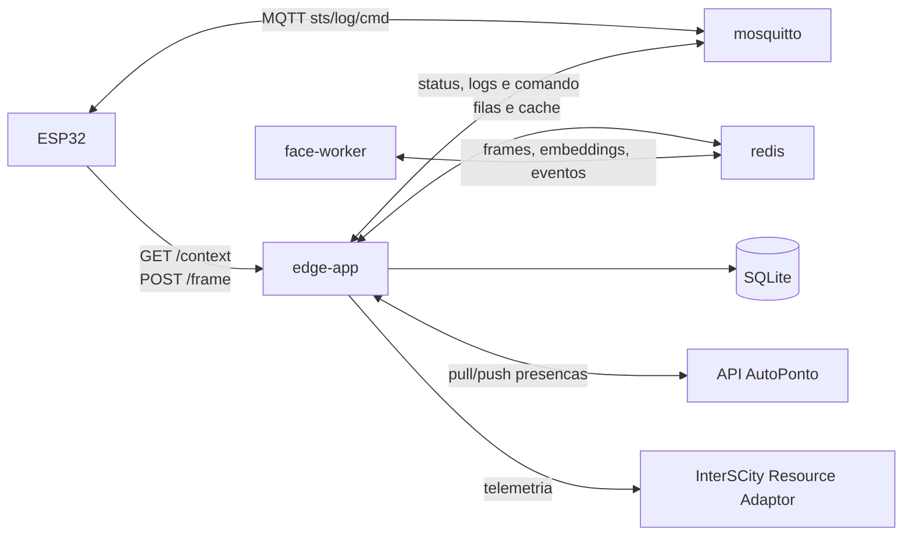
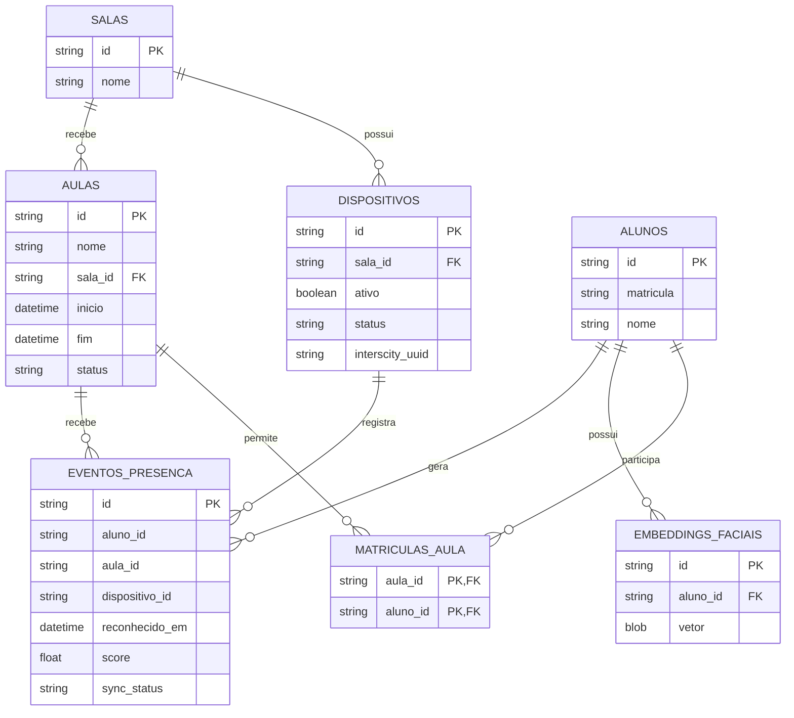
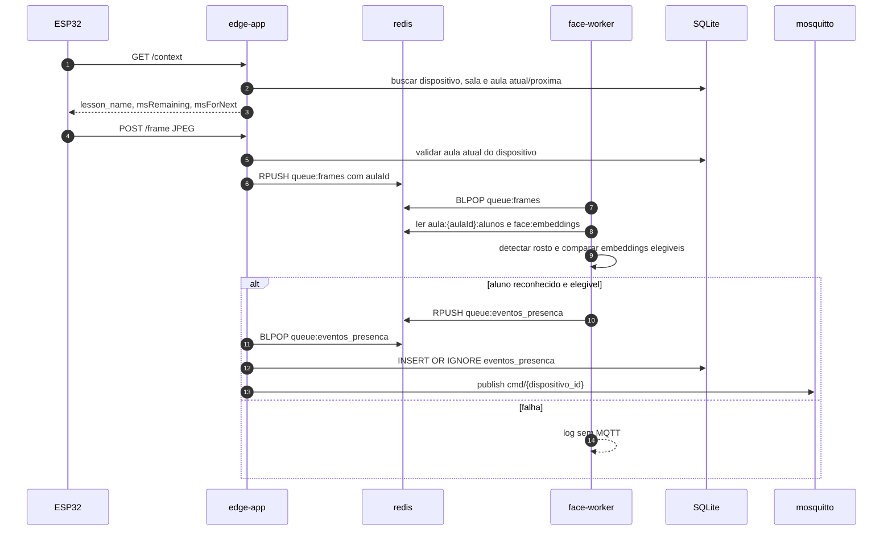
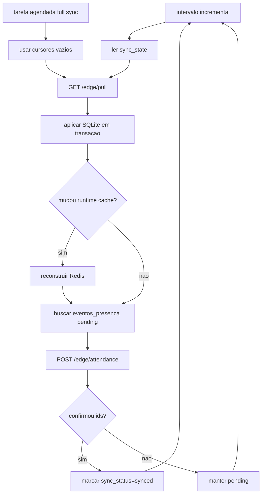
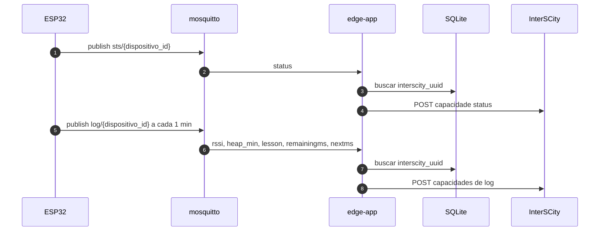

# AutoPonto Edge Node

Computacao de borda para Raspberry Pi do AutoPonto.

O node conversa com:

- ESP32 via HTTP e MQTT local;
- API principal AutoPonto via polling autenticado;
- plataforma InterSCity via Resource Adaptor;
- modelos ONNX locais para deteccao e reconhecimento facial.

## Arquitetura

Containers ativos:

- `edge-app`: API HTTP, MQTT local, SQLite, sincronizacao, telemetria e persistencia de presenca.
- `face-worker`: OpenCV/ONNX, reconhecimento facial e emissao de evento positivo.
- `redis`: filas e cache quente reconstruivel.
- `mosquitto`: broker MQTT local para os ESP32.



## Modelo Local

O edge nao replica o modelo academico completo da API principal. Ele guarda so o que precisa para operar offline:

- saber qual dispositivo esta em qual sala;
- descobrir a aula atual da sala;
- validar se o aluno pertence a aula;
- reconhecer rostos por embeddings;
- registrar uma presenca valida e sincronizavel;
- armazenar o UUID InterSCity do dispositivo quando existir.

Tabelas SQLite:

- `salas`: `id`, `nome`
- `dispositivos`: `id`, `sala_id`, `ativo`, `status`, `interscity_uuid`
- `aulas`: `id`, `nome`, `sala_id`, `inicio`, `fim`, `status`
- `alunos`: `id`, `matricula`, `nome`
- `matriculas_aula`: `aula_id`, `aluno_id`
- `embeddings_faciais`: `id`, `aluno_id`, `vetor`
- `eventos_presenca`: `id`, `aluno_id`, `aula_id`, `dispositivo_id`, `reconhecido_em`, `score`, `sync_status`
- `sync_state`: `entity`, `cursor`

`eventos_presenca` tem `UNIQUE(aluno_id, aula_id)`. Portanto, reconhecer a mesma pessoa de novo na mesma aula nao cria uma segunda presenca; o feedback usa o horario da primeira presenca.



## Redis

Redis e fila/cache, nao fonte duravel.

- `queue:frames`: frames JPEG recebidos do ESP32.
- `queue:eventos_presenca`: eventos positivos gerados pelo `face-worker`.
- `face:embeddings`: hash de embeddings por `embedding_id`.
- `aula:{aula_id}:alunos`: set de alunos elegiveis para a aula.
- `dispositivo:{dispositivo_id}:status`: ultimo status MQTT recebido.
- `dispositivos:last_seen`: hash simples de ultimo visto por dispositivo.

Exemplos de estrutura:

```text
queue:frames
tipo: list
valor: msgpack({
  "dispositivoId": "dispositivo-uuid",
  "salaId": "sala-uuid",
  "aulaId": "aula-uuid",
  "receivedAt": "2026-06-18T20:10:00.000000+00:00",
  "frame": "<jpeg-bytes>"
})

queue:eventos_presenca
tipo: list
valor: msgpack({
  "eventId": "evento-local-uuid",
  "dispositivoId": "dispositivo-uuid",
  "aulaId": "aula-uuid",
  "alunoId": "aluno-uuid",
  "score": 0.72,
  "recognizedAt": "2026-06-18T20:10:03.000000+00:00"
})

face:embeddings
tipo: hash
campo: "embedding-uuid"
valor: msgpack({
  "alunoId": "aluno-uuid",
  "embedding": "<blob-msgpack-do-vetor>"
})

aula:aula-uuid:alunos
tipo: set
membros: "aluno-uuid-1", "aluno-uuid-2"

dispositivo:dispositivo-uuid:status
tipo: string
valor: {
  "dispositivoId": "dispositivo-uuid",
  "status": "working",
  "reportadoEm": "2026-06-18T20:10:00.000000+00:00"
}

dispositivos:last_seen
tipo: hash
campo: "dispositivo-uuid"
valor: "2026-06-18T20:10:00.000000+00:00"
```

## API Local Para ESP32

### `GET /context`

Headers:

- `X-Device-Id`
- `X-Auth`

Resposta mantida simples para o firmware:

```json
{
  "lesson_name": "AMBIENTAL",
  "msRemaining": 6500000,
  "msForNext": 0
}
```

### `POST /frame`

Headers:

- `X-Device-Id`
- `X-Auth`
- `Content-Type: image/jpeg`

O frame so entra em `queue:frames` se existir uma aula atual para a sala do dispositivo.

Item interno da fila:

```json
{
  "dispositivoId": "dispositivo-uuid",
  "salaId": "sala-uuid",
  "aulaId": "aula-uuid",
  "receivedAt": "2026-06-18T12:00:00Z",
  "frame": "<bytes>"
}
```

## Fluxo De Presenca



Payload MQTT positivo:

```json
{
  "auth": true,
  "msg": "Daniel Silva - registrado 08:42"
}
```

Nao ha MQTT negativo. Falha de decode, sem rosto, aluno desconhecido ou aluno fora da aula atual apenas gera log.

## Sincronizacao Com A API AutoPonto

Se `AUTOPONTO_API_URL` estiver vazio, o edge opera offline e nao tenta sincronizar com a API principal.

Autenticacao:

```http
Authorization: NodeToken <AUTOPONTO_API_TOKEN>
X-Node-Id: <NODE_ID>
```

`NODE_ID` deve ser o `NoBorda.codigo` ou o UUID do no associado ao token.

### Pull

Endpoint:

```http
GET /edge/pull?node_id=<NODE_ID>&cursors=<msgpack-hex>
```

Payload esperado:

```json
{
  "data": {
    "salas": [],
    "dispositivos": [],
    "aulas": [],
    "alunos": [],
    "matriculas_aula": [],
    "embeddings_faciais": []
  },
  "deleted": {
    "salas": [],
    "dispositivos": [],
    "aulas": [],
    "alunos": [],
    "matriculas_aula": [],
    "embeddings_faciais": []
  },
  "cursors": {
    "aulas": "2026-06-18T12:00:00Z"
  }
}
```

Cursores:

- `cursors` sao marcadores incrementais por entidade, salvos em `sync_state`.
- Na primeira sincronizacao, o edge envia cursor vazio (`80` em msgpack-hex, equivalente a `{}`) e o backend deve retornar tudo que o node precisa.
- Depois de aplicar o pull com sucesso, o edge salva os cursores retornados pelo backend.
- No proximo ciclo, o edge envia esses cursores para receber apenas alteracoes posteriores.
- Cada entidade tem cursor proprio, por exemplo `aulas`, `alunos` e `embeddings_faciais`.
- O cursor deve ser tratado como opaco pelo edge; normalmente sera um timestamp/versao controlado pela API principal.
- Se um cursor for apagado localmente, aquela entidade volta a fazer sync completo no proximo pull.
- O servico faz sync incremental por `SYNC_INTERVAL_SECONDS`.
- Pull completo deve ser acionado por comando manual ou tarefa agendada, enviando cursores vazios sem apagar dados locais.

Campos por recurso:

- `salas`: `id`, `nome`
- `dispositivos`: `id`, `sala_id`, `ativo`, `status`, `interscity_uuid`
- `aulas`: `id`, `nome`, `sala_id`, `inicio`, `fim`, `status`
- `alunos`: `id`, `matricula`, `nome`
- `matriculas_aula`: `aula_id`, `aluno_id`
- `embeddings_faciais`: `id`, `aluno_id`, `vetor`

O edge aplica o pull em transacao SQLite. O cache Redis so e reconstruido quando o pull traz alteracoes ou delecoes em `aulas`, `alunos`, `matriculas_aula` ou `embeddings_faciais`.

### Push De Presencas

Endpoint:

```http
POST /edge/attendance
```

Payload:

```json
{
  "node_id": "NO-CCET-01",
  "eventos": [
    {
      "id": "evento-local-uuid",
      "aluno_id": "aluno-uuid",
      "aula_id": "aula-uuid",
      "dispositivo_id": "dispositivo-uuid",
      "reconhecido_em": "2026-06-18T11:42:00Z",
      "score": 0.72
    }
  ]
}
```

Resposta esperada:

```json
{
  "synced_ids": ["evento-local-uuid"]
}
```



### Sync Manual

O comando manual para um ciclo incremental e:

```bash
docker compose exec -T edge-app python -m app.sync
```

O comando manual para um pull completo, usando cursores vazios, e:

```bash
docker compose exec -T edge-app python -m app.sync --full
```

O agendamento recomendado desse comando fica na secao de setup.

## Telemetria InterSCity

Status e logs dos ESP32 nao sao enviados para a API AutoPonto. O edge publica diretamente no Resource Adaptor do InterSCity quando:

- `INTERSCITY_API_URL` e `RESOURCE_ADAPTOR_PATH` estao configurados;
- o dispositivo local tem `interscity_uuid`;
- o Resource Adaptor aceita o recurso/capacidade.

Variaveis:

```env
INTERSCITY_API_URL=https://cidadesinteligentes.lsdi.ufma.br/interscity_lh
RESOURCE_ADAPTOR_PATH=/adaptor/resources
```

Endpoint usado:

```http
POST {INTERSCITY_API_URL}{RESOURCE_ADAPTOR_PATH}/{interscity_uuid}/data
```

`sts/{dispositivo_id}` e publicado separadamente pelo firmware e vira somente a capacidade `status`:

```json
{
  "data": {
    "status": [
      {
        "value": "working",
        "timestamp": "2026-06-19T00:21:43.000"
      }
    ]
  }
}
```

`log/{dispositivo_id}` e publicado a cada minuto pelo firmware e vira somente estas capacidades:

- `rssi`
- `heap_min`
- `lesson`
- `remainingms`
- `nextms`

`state` nao e publicado em logs porque representa status. O firmware tambem deve remover `state` do payload de log.

Exemplo de log convertido:

```json
{
  "data": {
    "rssi": [
      {
        "value": -62,
        "timestamp": "2026-06-19T00:22:43.000"
      }
    ],
    "heap_min": [
      {
        "value": 123456,
        "timestamp": "2026-06-19T00:22:43.000"
      }
    ],
    "lesson": [
      {
        "value": "AMBIENTAL",
        "timestamp": "2026-06-19T00:22:43.000"
      }
    ],
    "remainingms": [
      {
        "value": 60000,
        "timestamp": "2026-06-19T00:22:43.000"
      }
    ],
    "nextms": [
      {
        "value": 0,
        "timestamp": "2026-06-19T00:22:43.000"
      }
    ]
  }
}
```

Se InterSCity estiver indisponivel ou os recursos/capacidades ainda nao existirem, o edge apenas registra warning e continua operando localmente.
Para testes sem recursos/capacidades cadastrados, deixe `INTERSCITY_API_URL` vazio ou nao envie `interscity_uuid` no pull dos dispositivos.



## Reset De Dados Local

Use quando mudar schema local ou contrato de sync:

```bash
docker compose down -v --remove-orphans
rm -f data/db/db.sql data/db/db.sql-wal data/db/db.sql-shm
docker compose up -d --build
```

Depois do reset, os dados locais devem vir exclusivamente de `GET /edge/pull`.

## Setup

```bash
sudo apt update && sudo apt upgrade -y
curl -fsSL https://get.docker.com | sh
sudo usermod -aG docker $USER
sudo apt install docker-compose-plugin -y
sudo sysctl vm.overcommit_memory=1
```

```bash
cp .env.example .env
chmod +x scripts/init-mosquitto-password.sh
./scripts/init-mosquitto-password.sh
docker compose up -d --build
docker compose ps
```

### Agendamento Do Sync Completo

Depois de subir a stack, agende um pull completo diario no host da Raspberry Pi. O sync incremental continua rodando dentro do `edge-app` por `SYNC_INTERVAL_SECONDS`; este cron serve apenas para forcar um pull completo com cursores vazios.

Crie o diretorio de logs e edite o crontab do usuario que executa Docker:

```bash
mkdir -p data/logs
crontab -e
```

Exemplo para executar todo dia as 03:15:

```cron
15 3 * * * cd /home/daniel/autoponto-edgenode && docker compose exec -T edge-app python -m app.sync --full >> data/logs/full-sync.log 2>&1
```

Ajuste o caminho do repositorio se ele estiver em outro diretorio. Se a API AutoPonto estiver offline, o comando falha sem apagar o SQLite/Redis local; o sync incremental normal continua tentando depois.

## Modelos ONNX

```bash
wget https://github.com/opencv/opencv_zoo/raw/main/models/face_detection_yunet/face_detection_yunet_2023mar.onnx -O ./data/models/face_detection_yunet.onnx
wget https://github.com/opencv/opencv_zoo/raw/main/models/face_recognition_sface/face_recognition_sface_2021dec.onnx -O ./data/models/face_recognition_sface.onnx
```

## Prompts De Referencia

As alteracoes esperadas na API principal e no firmware ficam em documentos separados, em formato de prompt para LLM:

- [docs/prompt-referencia-api.md](docs/prompt-referencia-api.md)
- [docs/prompt-referencia-firmware.md](docs/prompt-referencia-firmware.md)

Os diretorios `referencia-api/` e `referencia-firmware/` sao apenas referencia local e nao devem ser editados por este projeto.
