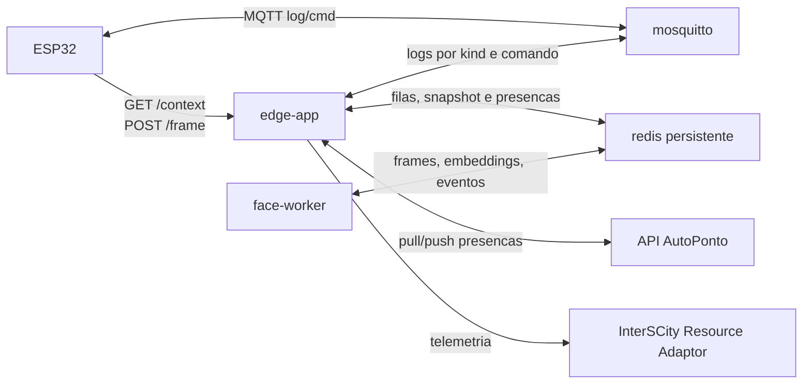
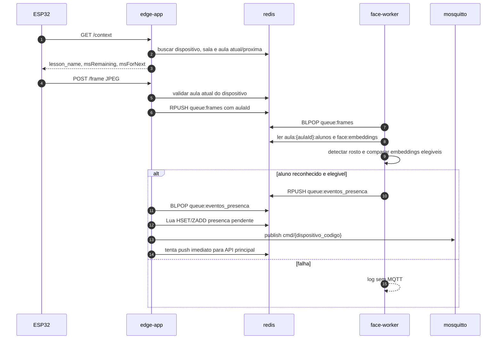
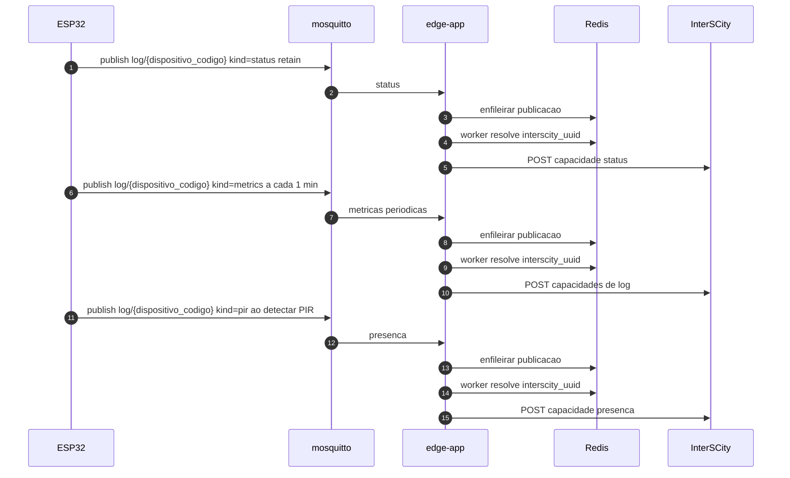

# AutoPonto Edge Node

Computacao de borda para Raspberry Pi do AutoPonto.

O node conversa com:

- ESP32 via HTTP e MQTT local;
- API principal AutoPonto via pull/push autenticado;
- plataforma InterSCity via Resource Adaptor;
- modelos ONNX locais para deteccao e reconhecimento facial.

## Arquitetura

Containers ativos:

- `edge-app`: API HTTP, MQTT local, sincronizacao, telemetria e persistencia Redis.
- `face-worker`: OpenCV/ONNX, reconhecimento facial e emissao de evento positivo.
- `redis`: filas, snapshot diario e presencas pendentes com AOF.
- `mosquitto`: broker MQTT local para os ESP32.



## Modelo Local Em Redis

O edge guarda no Redis persistente apenas o necessario para operar offline durante o dia: dispositivo por MAC/codigo, aulas validas por sala, alunos elegiveis por aula, nomes de alunos, embeddings faciais, filas de trabalho e presencas ainda nao sincronizadas. O Redis usa volume Docker e AOF `everysec`.

O snapshot vale somente para a data local corrente. Se `snapshot:data` estiver ausente ou for de outro dia, `/frame` retorna `snapshot_expired` e `/context` retorna contexto vazio ate o proximo pull valido da API principal.

Chaves principais:

- `snapshot:data`: data local do snapshot (`YYYY-MM-DD`).
- `snapshot:synced_at`: timestamp retornado pela API principal.
- `queue:frames`: frames JPEG recebidos do ESP32.
- `queue:eventos_presenca`: eventos positivos gerados pelo `face-worker`.
- `dispositivos:por_codigo`: hash por MAC/codigo do ESP32.
- `sala:{sala_id}:aulas`: aulas validas da sala, ordenadas por inicio.
- `aula:{aula_id}:alunos`: set de alunos elegiveis para a aula.
- `alunos:por_id`: hash minimo para montar feedback de presenca.
- `face:embeddings`: hash de embeddings por `embedding_id`.
- `presenca:eventos`: hash `event_id -> evento`.
- `presenca:por_aluno_aula`: hash `aluno_id:aula_id -> event_id`.
- `presenca:pendentes`: sorted set de eventos ainda nao enviados.
- `presenca:sincronizadas`: sorted set usado para retencao local.

Reconhecer a mesma pessoa de novo na mesma aula nao cria uma segunda presenca: o indice `presenca:por_aluno_aula` garante idempotencia. Eventos pendentes nao sao removidos por limite local; o edge poda apenas historico sincronizado acima de `MAX_EVENTOS_PRESENCA_REDIS`.

Exemplos de estrutura:

```text
queue:frames
tipo: list
valor: msgpack({
  "dispositivoId": "dispositivo-uuid",
  "dispositivoCodigo": "ESP32-LAB101",
  "salaId": "sala-uuid",
  "aulaId": "aula-uuid",
  "receivedAt": "2026-06-18T20:10:00.000000+00:00",
  "frame": "<jpeg-bytes>"
})

queue:eventos_presenca
tipo: list
valor: msgpack({
  "eventId": "evento-local-uuid",
  "dispositivoId": "dispositivo-uuid",
  "aulaId": "aula-uuid",
  "alunoId": "aluno-uuid",
  "score": 0.72,
  "recognizedAt": "2026-06-18T20:10:03.000000+00:00"
})

face:embeddings
tipo: hash
campo: "embedding-uuid"
valor: msgpack({
  "alunoId": "aluno-uuid",
  "embedding": "<blob-msgpack-do-vetor>"
})

dispositivos:por_codigo
tipo: hash
campo: "ESP32-LAB101"
valor: msgpack({
  "dispositivo_id": "dispositivo-uuid",
  "dispositivo_codigo": "ESP32-LAB101",
  "sala_id": "sala-uuid",
  "ativo": true,
  "interscity_uuid": "resource-uuid"
})

sala:sala-uuid:aulas
tipo: string
valor: msgpack([
  {
    "id": "aula-uuid",
    "nome": "Calculo",
    "turma_id": "turma-uuid",
    "sala_id": "sala-uuid",
    "inicio": "2026-06-18T20:00:00-03:00",
    "fim": "2026-06-18T21:40:00-03:00",
    "status": "ABERTA"
  }
])

aula:aula-uuid:alunos
tipo: set
membros: "aluno-uuid-1", "aluno-uuid-2"

presenca:eventos
tipo: hash
campo: "evento-local-uuid"
valor: msgpack({
  "id": "evento-local-uuid",
  "aluno_id": "aluno-uuid",
  "aluno_nome": "Daniel Silva",
  "aula_id": "aula-uuid",
  "dispositivo_id": "dispositivo-uuid",
  "dispositivo_codigo": "ESP32-LAB101",
  "reconhecido_em": "2026-06-18T20:10:03.000000+00:00",
  "score": 0.72
})
```

## API Local Para ESP32

### `GET /context`

Headers:

- `X-Device-Id`: MAC/codigo do ESP32
- `X-Auth`

Resposta mantida simples para o firmware:

```json
{
  "lesson_name": "AMBIENTAL",
  "msRemaining": 6500000,
  "msForNext": 0
}
```

### `POST /frame`

Headers:

- `X-Device-Id`: MAC/codigo do ESP32
- `X-Auth`
- `Content-Type: image/jpeg`

O frame so entra em `queue:frames` se existir no Redis um dispositivo ativo e uma aula atual para a sala do dispositivo.

Item interno da fila:

```json
{
  "dispositivoId": "dispositivo-uuid",
  "dispositivoCodigo": "ESP32-LAB101",
  "salaId": "sala-uuid",
  "aulaId": "aula-uuid",
  "receivedAt": "2026-06-18T12:00:00Z",
  "frame": "<bytes>"
}
```

## Fluxo De Presenca



Payload MQTT positivo:

```json
{
  "auth": true,
  "msg": "Daniel Silva - registrado 08:42"
}
```

Nao ha MQTT negativo. Falha de decode, sem rosto, aluno desconhecido ou aluno fora da aula atual apenas gera log.

## Sincronizacao Com A API AutoPonto

O edge sincroniza o snapshot Redis do dia e as presencas com a API principal. Horarios padrao UFMA nao sao buscados na API: o agendamento usa somente `data/horarios_ufma.json`.
Ao registrar uma presenca local, o edge tenta enviar esse evento imediatamente. Se o envio falhar, o evento permanece `pending` e volta a ser enviado pelos ciclos agendados de sincronizacao.

Autenticacao:

```http
Authorization: NodeToken <AUTOPONTO_API_TOKEN>
X-Node-Id: <NODE_ID>
```

### Pull

Endpoint:

```http
GET /edge/pull/?node_id=<NODE_ID>
```

Payload esperado:

```json
{
  "snapshot_data": "2026-06-18",
  "synced_at": "2026-06-18T12:00:00Z",
  "cache_redis": {
    "dispositivos_por_codigo": {},
    "aulas_por_sala": {},
    "alunos_por_aula": {},
    "alunos_por_id": {},
    "embeddings_faciais": {}
  }
}
```

Snapshot:

- O backend retorna sempre um snapshot autoritativo do dia pronto para gravar no Redis.
- O edge substitui atomicamente as chaves de snapshot/cache a cada pull.
- Nao ha `data`, entidades completas, `full=true`, `cursors`, incremental nem `deleted`.
- Horarios padrao UFMA nao fazem parte do pull; o agendamento usa o JSON local.

Campos esperados em `cache_redis`:

- `dispositivos_por_codigo`: por MAC/codigo, contendo `dispositivo_id`, `dispositivo_codigo`, `sala_id`, `ativo`, `interscity_uuid`.
- `aulas_por_sala`: listas de aulas com `id`, `nome`, `turma_id`, `sala_id`, `inicio`, `fim`, `status`.
- `alunos_por_aula`: mapa `aula_id -> [aluno_id]`.
- `alunos_por_id`: mapa `aluno_id -> {"nome": "..."}`.
- `embeddings_faciais`: mapa `embedding_id -> {"alunoId": "...", "embedding": {"dtype": "float32", "shape": [1, N], "data": [...]}}`.

### Push De Presencas

Endpoint:

```http
POST /edge/attendance/
```

Payload:

```json
{
  "node_id": "NO-CCET-01",
  "eventos": [
    {
      "id": "evento-local-uuid",
      "aluno_id": "aluno-uuid",
      "aula_id": "aula-uuid",
      "dispositivo_id": "dispositivo-uuid",
      "reconhecido_em": "2026-06-18T11:42:00Z",
      "score": 0.72
    }
  ]
}
```

Resposta esperada:

```json
{
  "synced_ids": ["evento-local-uuid"]
}
```

### Sync Manual

O script executa o pull snapshot autoritativo usado tanto manualmente quanto pelos agendamentos.

```bash
./scripts/sincronizacao-edge.sh
```

## Telemetria InterSCity

Status e logs dos ESP32 nao sao enviados para a API AutoPonto. O edge publica diretamente no Resource Adaptor do InterSCity quando:

- `INTERSCITY_API_URL` e `RESOURCE_ADAPTOR_PATH` estao configurados;
- o cache Redis do dispositivo por MAC/codigo tem `interscity_uuid`;
- o Resource Adaptor aceita o recurso/capacidade.

Variaveis:

```env
INTERSCITY_API_URL=https://cidadesinteligentes.lsdi.ufma.br/interscity_lh
RESOURCE_ADAPTOR_PATH=/adaptor/resources
INTERSCITY_QUEUE_MAX=1000
INTERSCITY_WORKERS=1
INTERSCITY_TIMEOUT_SECONDS=5
```

Endpoint usado:

```http
POST {INTERSCITY_API_URL}{RESOURCE_ADAPTOR_PATH}/{interscity_uuid}/data
```

Todos os registros do firmware chegam por `log/{dispositivo_codigo}` em JSON com o campo `kind`. `dispositivo_codigo` e o MAC/codigo usado pelo ESP32.

`kind=status` vira a capacidade `status`:

```json
{
  "kind": "status",
  "status": "working"
}
```

No firmware, mensagens `kind=status` devem usar `retain=true`. O Last Will tambem deve usar o mesmo topico `log/{dispositivo_codigo}`, payload `{"kind":"status","status":"offline"}` e `retain=true`. Mensagens `kind=metrics` e `kind=pir` nao devem usar retain.

Payload InterSCity gerado:

```json
{
  "data": {
    "status": [
      {
        "value": "working",
        "timestamp": "2026-06-19T00:21:43.000"
      }
    ]
  }
}
```

`kind=metrics` e publicado a cada minuto pelo firmware e vira somente estas capacidades:

- `heap_free`
- `psram_free`
- `now_ms`
- `rssi`
- `heap_min`
- `lesson`
- `remaining_ms`
- `next_ms`

Se `METRICAS_AVG_US_DISPOSITIVO_CODIGO` estiver configurado e o payload desse dispositivo tiver `avg_us`, o edge atualiza o TXT local definido por `METRICAS_AVG_US_PATH` (`/data/logs/metricas_avg_us.txt` por padrao). O arquivo guarda `registros`, `periodo_inicio`, `periodo_fim` e a media acumulada dos campos `loop`, `mqtt`, `network`, `camera` e `display`; cada novo valor faz `(valor_antigo + valor_novo) / 2`. Com `METRICAS_AVG_US_DISPOSITIVO_CODIGO` vazio, esse TXT nao e gerado.

`state` nao e publicado em logs porque representa status. O firmware tambem deve remover `state` do payload de log.

`kind=pir` e publicado quando o sensor PIR detectar presenca e vira a capacidade `presenca`. Esse evento nao vem da funcao periodica de metricas.

Exemplo de `kind=metrics`:

```json
{
  "kind": "metrics",
  "heap_free": 120000,
  "psram_free": 3000000,
  "now_ms": 123456,
  "rssi": -62,
  "heap_min": 123456,
  "lesson": "AMBIENTAL",
  "remaining_ms": 60000,
  "next_ms": 0,
  "avg_us": {
    "loop": 100,
    "mqtt": 200,
    "network": 300,
    "camera": 400,
    "display": 500
  }
}
```

Payload InterSCity gerado:

```json
{
  "data": {
    "heap_free": [
      {
        "value": 120000,
        "timestamp": "2026-06-19T00:22:43.000"
      }
    ],
    "psram_free": [
      {
        "value": 3000000,
        "timestamp": "2026-06-19T00:22:43.000"
      }
    ],
    "now_ms": [
      {
        "value": 123456,
        "timestamp": "2026-06-19T00:22:43.000"
      }
    ],
    "rssi": [
      {
        "value": -62,
        "timestamp": "2026-06-19T00:22:43.000"
      }
    ],
    "heap_min": [
      {
        "value": 123456,
        "timestamp": "2026-06-19T00:22:43.000"
      }
    ],
    "lesson": [
      {
        "value": "AMBIENTAL",
        "timestamp": "2026-06-19T00:22:43.000"
      }
    ],
    "remaining_ms": [
      {
        "value": 60000,
        "timestamp": "2026-06-19T00:22:43.000"
      }
    ],
    "next_ms": [
      {
        "value": 0,
        "timestamp": "2026-06-19T00:22:43.000"
      }
    ]
  }
}
```

Exemplo de `kind=pir`:

```json
{
  "kind": "pir",
  "presenca": true
}
```

Payload InterSCity gerado:

```json
{
  "data": {
    "presenca": [
      {
        "value": true,
        "timestamp": "2026-06-19T00:23:10.000"
      }
    ]
  }
}
```

O listener MQTT apenas enfileira a publicacao. Workers em background fazem o POST para o InterSCity. Se a fila estiver cheia ou o InterSCity estiver indisponivel, o edge registra warning e continua operando localmente.
Para testes sem recursos/capacidades cadastrados, deixe `INTERSCITY_API_URL` vazio ou nao envie `interscity_uuid` no pull dos dispositivos.



## Reset De Dados Local

Use quando quiser apagar snapshot, filas e presencas locais do Redis:

```bash
docker compose down -v --remove-orphans
docker compose up -d --build
```

Depois do reset, o edge so volta a reconhecer quando receber um snapshot valido do dia pela API principal.

## Setup

```bash
sudo apt update && sudo apt upgrade -y
curl -fsSL https://get.docker.com | sh
sudo usermod -aG docker $USER
sudo apt install docker-compose-plugin -y
sudo sysctl vm.overcommit_memory=1
```

```bash
cp .env.example .env
chmod +x scripts/init-mosquitto-password.sh
./scripts/init-mosquitto-password.sh
docker compose up -d --build
docker compose ps
```

### Agendamento Do Sync

O `edge-app` nao tem loop interno de sincronizacao. Use a crontab do Linux para executar sync snapshot no startup, na virada de dia e antes dos inicios dos horarios padrao UFMA.

Revise as tarefas geradas sem alterar a crontab:

```bash
./scripts/atualizar-agendamentos-sincronizacao-edge.sh --dry-run
```

Grave ou atualize o bloco de tarefas do AutoPonto Edge:

```bash
./scripts/atualizar-agendamentos-sincronizacao-edge.sh
```

O script le `data/horarios_ufma.json` e recria somente o bloco entre `# AUTOPONTO EDGE SYNC BEGIN` e `# AUTOPONTO EDGE SYNC END`. Ele nao busca horarios padrao UFMA na API.

## Modelos ONNX

```bash
wget https://github.com/opencv/opencv_zoo/raw/main/models/face_detection_yunet/face_detection_yunet_2023mar.onnx -O ./data/models/face_detection_yunet.onnx
wget https://github.com/opencv/opencv_zoo/raw/main/models/face_recognition_sface/face_recognition_sface_2021dec.onnx -O ./data/models/face_recognition_sface.onnx
```

## Prompts De Referencia

As alteracoes esperadas na API principal ficam em formato de prompt para LLM:

- [docs/prompt-referencia-api.md](docs/prompt-referencia-api.md)

Os diretorios `referencia-api/` e `referencia-firmware/` sao apenas referencia local e nao devem ser editados por este projeto.
