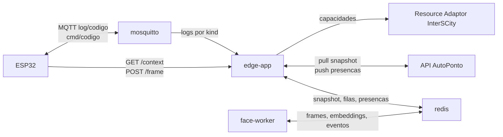
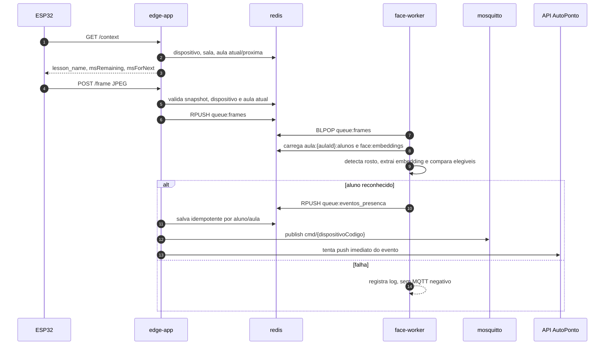

# AutoPonto Edge Node

Computacao de borda do AutoPonto para Raspberry Pi. O node fica entre os ESP32,
a API principal do AutoPonto, o Redis local, o broker MQTT local e o InterSCity.

Ele foi desenhado para continuar operando durante o dia mesmo sem rede externa,
desde que tenha recebido um snapshot valido do dia.

## Componentes

| Componente | Funcao |
| --- | --- |
| `edge-app` | API HTTP local para ESP32, consumidor MQTT, sync com API AutoPonto, publicacao InterSCity e consumo de eventos de presenca. |
| `face-worker` | Le frames do Redis, roda OpenCV/ONNX, compara embeddings elegiveis da aula e gera evento positivo. |
| `redis` | Snapshot do dia, filas, embeddings descriptografados e presencas pendentes/sincronizadas. |
| `mosquitto` | Broker MQTT local para logs dos dispositivos e comandos do edge. |



## Setup Rapido

Instale Docker e o plugin Compose:

```bash
sudo apt update && sudo apt upgrade -y
curl -fsSL https://get.docker.com | sh
sudo usermod -aG docker "$USER"
sudo apt install docker-compose-plugin -y
sudo sysctl vm.overcommit_memory=1
```

Prepare o ambiente:

```bash
cp .env.example .env
chmod +x scripts/*.sh
```

Preencha no `.env`, no minimo:

| Variavel | Uso |
| --- | --- |
| `EDGE_SHARED_AUTH` | Token que o ESP32 envia em `X-Auth` para `/context` e `/frame`. |
| `MQTT_PASS_DEVICE` | Senha do usuario MQTT `device`. |
| `MQTT_PASS_SERVICE` | Senha do usuario MQTT `service`, usado pelo `edge-app`. |
| `FACE_EMBEDDING_ENCRYPTION_KEY` | Chave Fernet igual a chave usada pelo backend para criptografar embeddings. |
| `NODE_UUID` | Identificador do no enviado em `X-Node-Id` e `node_id`. |
| `AUTOPONTO_API_URL` | Base URL da API principal. Se ficar vazio, o sync nao faz pull nem push. |
| `AUTOPONTO_API_TOKEN` | Token enviado como `Authorization: NodeToken ...`. |

Gere o arquivo de senha do Mosquitto a partir do `.env`:

```bash
./scripts/init-mosquitto-password.sh
```

Baixe ou copie os modelos ONNX para `data/models`:

```bash
wget https://github.com/opencv/opencv_zoo/raw/main/models/face_detection_yunet/face_detection_yunet_2023mar.onnx -O ./data/models/face_detection_yunet.onnx
wget https://github.com/opencv/opencv_zoo/raw/main/models/face_recognition_sface/face_recognition_sface_2021dec.onnx -O ./data/models/face_recognition_sface.onnx
```

Suba os servicos:

```bash
docker compose up -d --build
docker compose ps
curl http://localhost:${EDGE_API_PORT:-8080}/health
```

Execute o primeiro sync quando a API principal ja estiver configurada:

```bash
./scripts/sincronizacao-edge.sh
```

## Variaveis De Ambiente

As variaveis estao centralizadas em `.env.example` e sao injetadas pelo
`docker-compose.yml`.

| Variavel | Padrao no compose/config | Descricao |
| --- | --- | --- |
| `ZONE_INFO` | `America/Fortaleza` | Fuso usado para data do snapshot, aula atual e horario exibido no comando de presenca. |
| `EDGE_API_PORT` | `8080` | Porta HTTP publicada no host para o `edge-app`. |
| `LOG_LEVEL` | `INFO` | Nivel de log dos servicos Python. |
| `EDGE_SHARED_AUTH` | `replace` | Token local esperado em `X-Auth`. |
| `MQTT_PORT` | `1883` | Porta MQTT publicada no host. |
| `MQTT_PASS_DEVICE` | `replace` | Senha gravada para o usuario MQTT `device`. |
| `MQTT_PASS_SERVICE` | `replace` | Senha gravada para o usuario MQTT `service` e usada pelo `edge-app`. |
| `FACE_SCORE_THRESHOLD` | `0.8` | Limiar de deteccao facial passado ao YuNet no container. |
| `FACE_MATCH_THRESHOLD` | `0.363` | Limiar de reconhecimento por similaridade coseno no SFace. |
| `MAX_FRAME_QUEUE` | `100` | Tamanho maximo de `queue:frames` antes de `/frame` retornar `503`. |
| `MAX_EVENTOS_PRESENCA_REDIS` | `50000` | Limite de retencao para historico sincronizado. Pendentes nao sao podados por esse limite. |
| `NODE_UUID` | `edge-node` | No local usado no pull e no push da API principal. |
| `AUTOPONTO_API_URL` | vazio | Base URL da API principal. Vazio desativa sync externo. |
| `AUTOPONTO_API_TOKEN` | vazio | Token `NodeToken`. |
| `FACE_EMBEDDING_ENCRYPTION_KEY` | vazio | Chave Fernet obrigatoria para aceitar embeddings criptografados no pull. |
| `INTERSCITY_API_URL` | vazio no compose, preenchido no `.env.example` | Base URL do InterSCity. Vazio desativa publicacao externa. |
| `RESOURCE_ADAPTOR_PATH` | `/adaptor/resources` | Caminho do Resource Adaptor. |
| `INTERSCITY_QUEUE_MAX` | `1000` | Tamanho da fila local de publicacao InterSCity. |
| `INTERSCITY_WORKERS` | `1` | Numero de workers de publicacao InterSCity. |
| `INTERSCITY_TIMEOUT_SECONDS` | `5` | Timeout por POST ao InterSCity. |
| `METRICAS_AVG_US_PATH` | `/data/logs/metricas_avg_us.txt` | Arquivo TXT de medias `avg_us`. |
| `METRICAS_AVG_US_AMOSTRAS_PATH` | `/data/logs/metricas_avg_us_amostras.csv` | CSV append-only das capturas `avg_us`. |
| `METRICAS_AVG_US_DISPOSITIVO_CODIGO` | vazio | Codigo do unico dispositivo que deve alimentar o TXT. Vazio desativa o arquivo. |
| `TCC_EVIDENCIAS_ENABLED` | `1` no compose | Habilita logs de evidencias em CSV/resumo para testes do TCC. |
| `TCC_EVIDENCIAS_DIR` | `/data/logs/tcc` | Diretorio de `metricas_amostras.csv` e `metricas_resumo.txt`. |

Gere uma chave Fernet com:

```bash
python -c "from cryptography.fernet import Fernet; print(Fernet.generate_key().decode())"
```

## API Local Para ESP32

Todos os endpoints, exceto `/health`, exigem:

```http
X-Device-Id: <codigo-ou-mac-do-ESP32>
X-Auth: <EDGE_SHARED_AUTH>
```

### `GET /health`

Retorna:

```json
{"ok": true}
```

### `GET /context`

Consulta a aula atual ou a proxima aula da sala vinculada ao dispositivo.

Resposta:

```json
{
  "lesson_name": "Calculo",
  "msRemaining": 6500000,
  "msForNext": 0
}
```

Regras:

- Se `snapshot:data` nao for a data local corrente, retorna contexto vazio.
- Se o dispositivo nao existir, estiver inativo ou nao tiver aula atual/proxima, retorna contexto vazio.
- Aulas com status `FECHADA` ou `CANCELADA` sao ignoradas.

### `POST /frame`

Recebe um JPEG e empilha o frame para o `face-worker`.

Headers:

```http
X-Device-Id: <codigo-ou-mac-do-ESP32>
X-Auth: <EDGE_SHARED_AUTH>
Content-Type: image/jpeg
```

Respostas comuns:

```json
{"ok": true, "queue_len": 1}
```

```json
{"ok": false, "reason": "snapshot_expired"}
```

```json
{"ok": false, "reason": "unknown_device"}
```

```json
{"ok": false, "reason": "no_current_aula"}
```

O endpoint retorna `503` quando `queue:frames` chega em `MAX_FRAME_QUEUE`,
`415` para `Content-Type` diferente de `image/jpeg` e `400` para corpo vazio.

Item interno em `queue:frames`:

```json
{
  "dispositivoId": "dispositivo-uuid",
  "dispositivoCodigo": "ESP32-LAB101",
  "salaId": "sala-uuid",
  "aulaId": "aula-uuid",
  "receivedAt": "2026-06-18T12:00:00+00:00",
  "frame": "<jpeg-bytes>"
}
```

## Snapshot Redis

O Redis persistente guarda apenas o necessario para operar offline durante o
dia. O snapshot e valido somente quando `snapshot:data` e igual a data local
corrente em `ZONE_INFO`.

Chaves principais:

| Chave | Tipo | Uso |
| --- | --- | --- |
| `snapshot:data` | string | Data local do snapshot, `YYYY-MM-DD`. |
| `snapshot:synced_at` | string | Timestamp retornado pela API principal. |
| `dispositivos:por_codigo` | hash msgpack | Dispositivos por codigo/MAC do ESP32. |
| `sala:{sala_id}:aulas` | string msgpack | Lista de aulas da sala. |
| `aula:{aula_id}:alunos` | set | Alunos elegiveis para a aula. |
| `alunos:por_id` | hash msgpack | Dados minimos do aluno, hoje usados para nome. |
| `face:embeddings` | hash msgpack | Embeddings descriptografados por `embedding_id`. |
| `queue:frames` | list msgpack | Frames aguardando reconhecimento. |
| `queue:eventos_presenca` | list msgpack | Eventos positivos vindos do `face-worker`. |
| `presenca:eventos` | hash msgpack | Eventos de presenca locais. |
| `presenca:por_aluno_aula` | hash | Indice idempotente `aluno_id:aula_id -> event_id`. |
| `presenca:pendentes` | sorted set | Eventos ainda nao confirmados pela API principal. |
| `presenca:sincronizadas` | sorted set | Historico sincronizado sujeito a poda. |

Ao aplicar um novo pull, o edge substitui atomicamente as chaves do snapshot e
mantem as filas e presencas. Se a descriptografia ou validacao de qualquer
embedding falhar, o snapshot anterior continua em uso.

## Reconhecimento E Presenca



O `face-worker`:

- decodifica JPEG e rotaciona a imagem 180 graus antes da deteccao;
- detecta o melhor rosto com YuNet;
- extrai embedding com SFace;
- compara apenas embeddings de alunos elegiveis para `aulaId`;
- empilha evento positivo somente quando `score >= FACE_MATCH_THRESHOLD`.

O `edge-app` salva uma unica presenca por aluno/aula. Reconhecer a mesma pessoa
de novo na mesma aula reaproveita o evento existente e nao cria segunda presenca.

Comando MQTT de presenca positiva:

```json
{
  "auth": true,
  "msg": "Daniel Silva (08:42)"
}
```

Nao ha MQTT negativo para falha de decode, ausencia de rosto, aluno desconhecido
ou aluno fora da aula atual.

## Sincronizacao Com A API AutoPonto

O `edge-app` nao tem loop interno de sync. Use o script manual ou a crontab
gerada por `scripts/atualizar-agendamentos-sincronizacao-edge.sh`.

Comando manual:

```bash
./scripts/sincronizacao-edge.sh
```

Esse script executa dentro do container:

```bash
docker compose exec -T edge-app python -m app.sync
```

Para rodar sem enviar presencas pendentes:

```bash
docker compose exec -T edge-app python -m app.sync --sem-presencas
```

Autenticacao enviada ao backend:

```http
X-Node-Id: <NODE_UUID>
Authorization: NodeToken <AUTOPONTO_API_TOKEN>
```

Se `AUTOPONTO_API_TOKEN` estiver vazio, o header `Authorization` nao e enviado.

### Pull

Endpoint:

```http
GET /edge/pull/?node_id=<NODE_UUID>
```

Payload esperado:

```json
{
  "snapshot_data": "2026-06-18",
  "synced_at": "2026-06-18T12:00:00Z",
  "cache_redis": {
    "dispositivos_por_codigo": {},
    "aulas_por_sala": {},
    "alunos_por_aula": {},
    "alunos_por_id": {},
    "embeddings_faciais": {}
  }
}
```

Campos em `cache_redis`:

| Campo | Formato |
| --- | --- |
| `dispositivos_por_codigo` | Mapa `codigo -> {dispositivo_id, dispositivo_codigo, sala_id, ativo, interscity_uuid}`. |
| `aulas_por_sala` | Mapa `sala_id -> [aulas]`, com `id`, `nome`, `turma_id`, `sala_id`, `inicio`, `fim`, `status`. |
| `alunos_por_aula` | Mapa `aula_id -> [aluno_id]`. |
| `alunos_por_id` | Mapa `aluno_id -> {"nome": "..."}` ou `aluno_id -> "Nome"`. |
| `embeddings_faciais` | Mapa `embedding_id -> {"alunoId": "...", "embedding_encrypted": "..."}`. |

O backend nao envia `embedding.data`, `dtype`, `shape`, payload incremental,
`deleted`, `cursors` nem `full=true`. O edge espera um snapshot autoritativo do
dia pronto para substituir o cache local.

Depois de aplicar o snapshot, o edge publica para cada dispositivo:

```json
{"fetch": true}
```

no topico:

```text
cmd/{dispositivo_codigo}
```

### Push De Presencas

Endpoint:

```http
POST /edge/attendance/
```

Payload:

```json
{
  "node_id": "NO-CCET-01",
  "eventos": [
    {
      "id": "evento-local-uuid",
      "aluno_id": "aluno-uuid",
      "aula_id": "aula-uuid",
      "dispositivo_id": "dispositivo-uuid",
      "reconhecido_em": "2026-06-18T11:42:00+00:00",
      "score": 0.72
    }
  ]
}
```

Resposta esperada:

```json
{
  "synced_ids": ["evento-local-uuid"]
}
```

Se `synced_ids` nao vier, o edge considera todos os eventos enviados como
sincronizados. Se o push falhar, os eventos continuam em `presenca:pendentes`.

## MQTT Local

O contrato MQTT atual e unico:

```text
log/{dispositivo_codigo}
```

com payload JSON contendo `kind`. Nao ha compatibilidade com topicos antigos
`sts/+` ou `pir/+`.

ACL do Mosquitto:

| Usuario | Permissoes |
| --- | --- |
| `device` | `read cmd/%c`, `write log/%c` |
| `service` | `readwrite #` |

`%c` e o client id MQTT. O firmware deve usar como client id o mesmo codigo
usado nos topicos.

### `kind=status`

Payload:

```json
{
  "kind": "status",
  "status": "working",
  "timestamp": "2026-06-19T00:21:43Z"
}
```

Regras:

- publicar em `log/{dispositivo_codigo}`;
- usar `retain=true`;
- configurar Last Will no mesmo topico com `{"kind":"status","status":"offline"}` e `retain=true`;
- nao incluir `state` em logs, porque `state` representa status.

Capacidade InterSCity gerada:

```json
{
  "data": {
    "status": [
      {
        "value": "working",
        "timestamp": "2026-06-19T00:21:43.000"
      }
    ]
  }
}
```

### `kind=metrics`

Payload:

```json
{
  "kind": "metrics",
  "heap_free": 120000,
  "heap_min": 110000,
  "heap_max": 180000,
  "psram_free": 3000000,
  "psram_min": 2800000,
  "psram_max": 3200000,
  "rssi": -62,
  "post_max_ms": 180,
  "avg_us": {
    "loop": 100,
    "mqtt": 200,
    "network": 300,
    "camera": 400,
    "display": 500
  },
  "avg_count": {
    "loop": 10,
    "mqtt": 10,
    "network": 10,
    "camera": 10,
    "display": 10
  }
}
```

Regras:

- publicar em `log/{dispositivo_codigo}`;
- usar `retain=false`;
- se `idle=true`, o edge ignora o payload inteiro;
- `avg_us` so atualiza TXT quando `avg_us` e `avg_count` sao objetos e
  `METRICAS_AVG_US_DISPOSITIVO_CODIGO` e igual ao codigo do dispositivo.

Capacidades InterSCity geradas quando os valores existem:

- `heap_free`
- `heap_min`
- `heap_max`
- `psram_free`
- `psram_min`
- `psram_max`
- `rssi`
- `post_max_ms`

Arquivo de medias `avg_us`:

```text
unidade=microssegundos
registros=3
periodo_inicio=2026-06-19T10:00:00-03:00
periodo_fim=2026-06-19T10:02:00-03:00
loop=100.00
loop_count=30
loop_desvio_padrao=12.30
loop_m2=4538.700000
mqtt=200.00
mqtt_count=30
mqtt_desvio_padrao=25.00
mqtt_m2=18750.000000
```

O arquivo fica em `METRICAS_AVG_US_PATH`, por padrao
`/data/logs/metricas_avg_us.txt`, persistido pelo volume `./data:/data`.
O desvio padrao e ponderado entre capturas recebidas, usando `avg_count`.
As linhas `*_m2` guardam o acumulador interno usado para continuar o calculo.
Cada captura tambem e registrada em `METRICAS_AVG_US_AMOSTRAS_PATH`.

### `kind=pir`

Payload:

```json
{
  "kind": "pir",
  "presenca": true,
  "timestamp": "2026-06-19T00:23:10Z"
}
```

Regras:

- publicar em `log/{dispositivo_codigo}`;
- usar `retain=false`;
- se `presenca` nao vier, o edge publica `true`.

Capacidade InterSCity gerada:

```json
{
  "data": {
    "presenca": [
      {
        "value": true,
        "timestamp": "2026-06-19T00:23:10.000"
      }
    ]
  }
}
```

## InterSCity

Status, metricas e PIR dos ESP32 nao passam pela API AutoPonto. O edge publica
direto no Resource Adaptor quando:

- `INTERSCITY_API_URL` e `RESOURCE_ADAPTOR_PATH` estao preenchidos;
- o dispositivo existe no snapshot Redis e tem `interscity_uuid`;
- o payload gera pelo menos uma capacidade com valor nao nulo.

Endpoint usado:

```http
POST {INTERSCITY_API_URL}/{RESOURCE_ADAPTOR_PATH}/{interscity_uuid}/data
```

O listener MQTT apenas enfileira a publicacao. Workers em background fazem o
POST. Se a fila estiver cheia ou o InterSCity estiver indisponivel, o edge
registra warning e continua operando localmente.

Para testes sem recurso/capacidade cadastrados, deixe `INTERSCITY_API_URL` vazio
ou nao envie `interscity_uuid` no pull dos dispositivos.

## Metricas E Evidencias Para O TCC

O edge gera evidencias locais para Metodologia e Analise dos Resultados:

| Arquivo | Uso |
| --- | --- |
| `/data/logs/tcc/metricas_amostras.csv` | Linhas append-only das amostras HTTP, fila, reconhecimento, sync e InterSCity. |
| `/data/logs/tcc/metricas_resumo.txt` | Quantidade, media e desvio padrao amostral por metrica. |
| `/data/logs/metricas_avg_us.txt` | Media ponderada e desvio padrao ponderado de `avg_us` do dispositivo selecionado. |
| `/data/logs/metricas_avg_us_amostras.csv` | Amostras append-only das capturas `avg_us`. |

As metricas gerais sao habilitadas por `TCC_EVIDENCIAS_ENABLED=1`, com saida em
`TCC_EVIDENCIAS_DIR`. As metricas `avg_us` continuam condicionadas a
`METRICAS_AVG_US_DISPOSITIVO_CODIGO`.

A matriz de metricas e os diagramas Mermaid usados no TCC estao em
[docs/tcc-evidencias.md](docs/tcc-evidencias.md).

## Agendamento De Sync

O edge nao busca horarios padrao UFMA na API principal. Os horarios usados para
agendar sync ficam em:

```text
data/horarios_ufma.json
```

Revisar a crontab gerada:

```bash
./scripts/atualizar-agendamentos-sincronizacao-edge.sh --dry-run
```

Aplicar a crontab:

```bash
./scripts/atualizar-agendamentos-sincronizacao-edge.sh
```

O script recria somente o bloco:

```text
# AUTOPONTO EDGE SYNC BEGIN
...
# AUTOPONTO EDGE SYNC END
```

Tarefas geradas:

- `@reboot sleep 300`: sync apos boot, a menos que use `--sem-reboot`;
- `0 0 * * *`: sync na virada do dia;
- um sync antes de cada `horario_inicio` de `data/horarios_ufma.json`.

Por padrao, a antecedencia e de 5 minutos. Para alterar:

```bash
./scripts/atualizar-agendamentos-sincronizacao-edge.sh --antecedencia-minutos 10
```

Detalhes dos scripts: [scripts/README.md](scripts/README.md).

## Persistencia Local

Volumes e mounts:

| Caminho | Uso |
| --- | --- |
| `redis_data` | AOF e snapshots Redis em `/data` do container. |
| `mosquitto_data` | Persistencia do broker Mosquitto. |
| `./data:/data` | Logs locais e metricas dos servicos. |
| `./data/models:/models:ro` | Modelos ONNX do `face-worker`. |

Redis usa AOF com `appendfsync everysec`. Mosquitto usa `persistence true`.

O diretorio `data/` e ignorado pelo Git, exceto `data/horarios_ufma.json` e
`data/models/.gitkeep`.

## Reset Local

Use quando quiser apagar snapshot, filas, presencas locais e dados persistidos
dos containers:

```bash
docker compose down -v --remove-orphans
docker compose up -d --build
```

Depois do reset, o edge so volta a reconhecer quando receber um snapshot valido
do dia pela API principal.

## Inicializacao Via systemd

Ha um exemplo em `edge-node.service.example`.

Uso esperado:

1. Copie o arquivo para `/etc/systemd/system/edge-node.service`.
2. Troque `[REPO PATH]` pelo caminho absoluto do repositorio.
3. Habilite o servico:

```bash
sudo systemctl daemon-reload
sudo systemctl enable --now edge-node.service
sudo systemctl status edge-node.service
```

## Operacao E Diagnostico

Comandos uteis:

```bash
docker compose ps
docker compose logs -f edge-app
docker compose logs -f face-worker
docker compose logs -f mosquitto
docker compose exec redis redis-cli GET snapshot:data
docker compose exec redis redis-cli ZCARD presenca:pendentes
docker compose exec redis redis-cli LLEN queue:frames
tail -n 40 data/logs/tcc/metricas_resumo.txt
tail -n 20 data/logs/tcc/metricas_amostras.csv
```

Validacoes locais:

```bash
docker compose config
PYTHONPYCACHEPREFIX=/tmp/autoponto-pycache python3 -m compileall services
python3 -m pytest tests
```

Falhas comuns:

| Sintoma | Causa provavel |
| --- | --- |
| `/context` vazio e `/frame` com `snapshot_expired` | Sem pull valido do dia ou `ZONE_INFO` incorreto. |
| `/frame` com `unknown_device` | `X-Device-Id` nao existe no snapshot ou dispositivo esta inativo. |
| `/frame` com `no_current_aula` | Sala do dispositivo nao tem aula aberta no horario local. |
| `frame queue full` | `face-worker` parado/lento ou `MAX_FRAME_QUEUE` baixo para a carga. |
| Pull falha em embeddings | `FACE_EMBEDDING_ENCRYPTION_KEY` ausente/incorreta ou payload criptografado invalido. |
| Sync nao faz nada | `AUTOPONTO_API_URL` vazio no container. |
| `ConnectError`/DNS no sync | Falha de rede/resolucao antes de chegar ao backend. |
| `400` com `node_id` | Token pode estar aceito, mas `NODE_UUID` nao corresponde ao no esperado pelo backend. |
| Dispositivo nao recebe `cmd/...` | Client id MQTT nao bate com o codigo usado nos topicos ou ACL/senha nao foram regenerados. |

Limitacoes conhecidas:

- O edge depende de snapshot valido do dia para reconhecer presencas.
- Nao ha MQTT negativo quando decode, deteccao ou reconhecimento falham.
- O sync nao roda em loop interno; depende de script manual, cron ou systemd.
- Publicacao InterSCity falha nao bloqueia reconhecimento local e nao tem retry persistente.
- O desvio padrao de `avg_us` e calculado entre capturas agregadas recebidas do firmware.

Os diretorios `referencia-api/` e `referencia-firmware/` sao referencias locais
ignoradas pelo Git e nao fazem parte do contrato versionado deste projeto.
