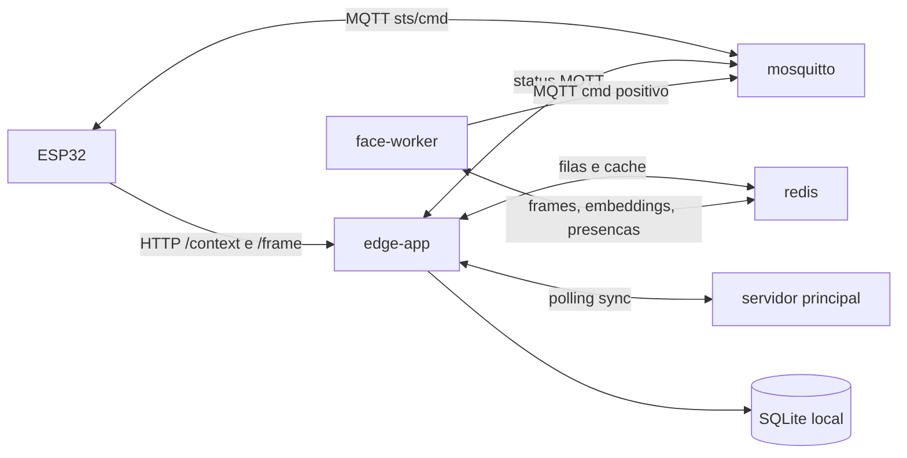
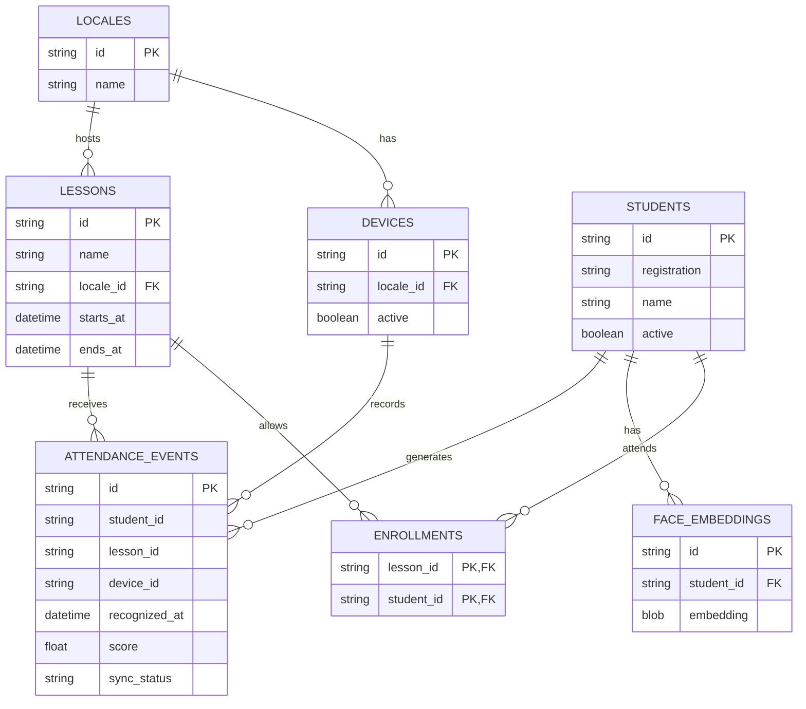
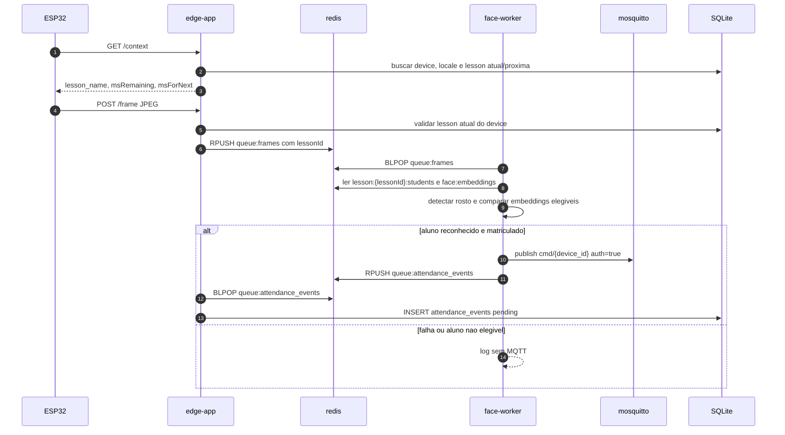
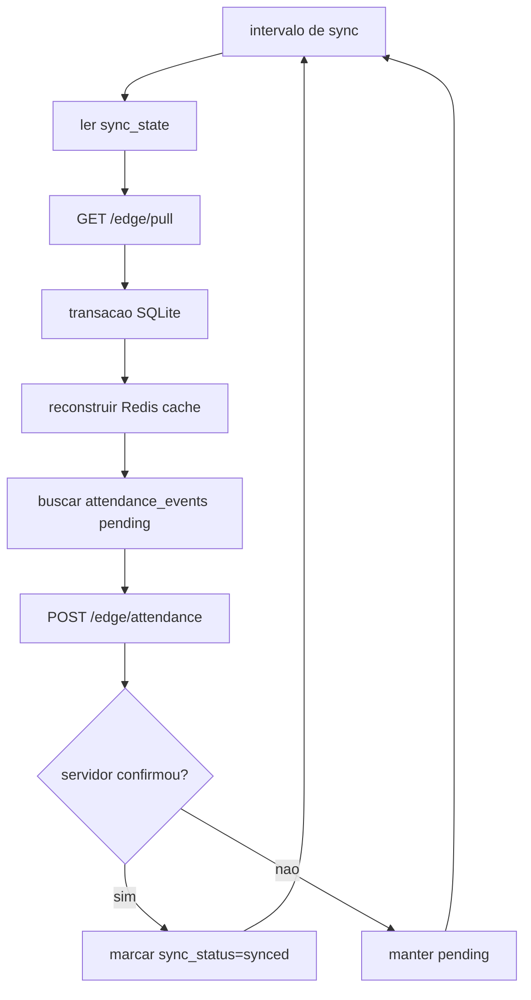

# AutoPonto Edge Node

Computacao de borda para Raspberry Pi do sistema AutoPonto.

O node conversa com:

- dispositivos ESP32 via HTTP e MQTT local;
- servidor principal via sincronizacao por polling;
- modelos ONNX locais para deteccao/reconhecimento facial.

## Arquitetura atual

Containers ativos:

- `edge-app`: API HTTP, listener MQTT de status, SQLite local, sync e persistencia de presencas.
- `face-worker`: processamento OpenCV/ONNX, reconhecimento facial e feedback MQTT positivo.
- `redis`: fila de frames, fila de presencas e cache quente de embeddings/elegibilidade.
- `mosquitto`: broker MQTT local para os ESP32.

O antigo `edge-api` e o antigo `mqtt-listener` foram fundidos no `edge-app`.



## Modelo local

`attendance_event` e uma presenca local valida: ela so existe quando um aluno foi reconhecido, esta matriculado na `lesson` atual do dispositivo e precisa ser sincronizado com o servidor principal.

`lesson` representa a cadeira/aula ofertada no edge, por exemplo `Algoritmos` ou `Matematica Aplicada`. Ela acontece em um `locale`, como `Laboratorio A` ou `Sala 208`, dentro de uma janela `starts_at`/`ends_at`.

`enrollments` e a tabela relacional entre estudantes e lessons. Ela responde a pergunta: este estudante pertence a esta aula atual?

SQLite e a fonte duravel local:

- `locales`: `id`, `name`
- `devices`: `id`, `locale_id`, `active`
- `lessons`: `id`, `name`, `locale_id`, `starts_at`, `ends_at`
- `students`: `id`, `registration`, `name`, `active`
- `enrollments`: `lesson_id`, `student_id`
- `face_embeddings`: `id`, `student_id`, `embedding`
- `attendance_events`: `id`, `student_id`, `lesson_id`, `device_id`, `recognized_at`, `score`, `sync_status`
- `sync_state`: `entity`, `cursor`

Redis e cache/fila reconstruivel:

- `queue:frames`
- `queue:attendance_events`
- `face:embeddings`
- `lesson:{lesson_id}:students`
- `device:{device_id}:status`
- `devices:last_seen`



## Fluxo de presenca

1. ESP32 chama `GET /context` com `X-Device-Id` e `X-Auth`.
2. `edge-app` consulta SQLite e retorna aula atual/proxima para o local do dispositivo.
3. ESP32 envia `POST /frame` com `Content-Type: image/jpeg`.
4. `edge-app` so enfileira o frame se houver `lesson` atual para o dispositivo.
5. `face-worker` consome `queue:frames`.
6. O reconhecimento compara apenas embeddings de alunos matriculados naquela `lesson`.
7. Em sucesso autorizado:
   - publica `cmd/{device_id}` com `auth: true` e `studentId`;
   - enfileira evento em `queue:attendance_events`;
   - `edge-app` persiste em `attendance_events` com `sync_status = pending`.
8. Em falha, sem rosto, aluno desconhecido ou aluno fora da lesson:
   - nao publica MQTT;
   - apenas registra log.



## Sincronizacao

O servidor principal ainda nao existe, entao o contrato abaixo define a expectativa do edge.

Se `MAIN_API_URL` estiver vazio, o node opera offline e nao tenta sincronizar. Quando configurado, `edge-app` roda um loop periodico:

1. Le os cursores locais em `sync_state`.
2. Chama `GET /edge/pull` com `node_id` e cursores.
3. Recebe cadastros alterados e remocoes.
4. Aplica tudo no SQLite dentro de uma transacao.
5. Reconstroi o cache Redis usado pelo `face-worker`.
6. Busca `attendance_events` com `sync_status = pending`.
7. Envia esses eventos para `POST /edge/attendance`.
8. Marca como `synced` apenas os IDs confirmados pelo servidor.
9. Se qualquer etapa falhar, mantem dados locais e tenta novamente no proximo ciclo.

Payload esperado de pull:

```json
{
  "data": {
    "locales": [],
    "devices": [],
    "lessons": [],
    "students": [],
    "enrollments": [],
    "face_embeddings": []
  },
  "deleted": {
    "locales": [],
    "devices": [],
    "lessons": [],
    "students": [],
    "enrollments": [],
    "face_embeddings": []
  },
  "cursors": {
    "students": "cursor-value"
  }
}
```



Variaveis:

- `NODE_ID`
- `MAIN_API_URL`
- `MAIN_API_TOKEN`
- `SYNC_INTERVAL_SECONDS`

Endpoints esperados no servidor principal:

- `GET /edge/pull`: retorna cadastros, horarios, alunos, matriculas, embeddings, remocoes e cursores.
- `POST /edge/attendance`: recebe presencas pendentes e retorna ids sincronizados.

## Setup

```bash
sudo apt update && sudo apt upgrade -y
curl -fsSL https://get.docker.com | sh
sudo usermod -aG docker $USER
sudo apt install docker-compose-plugin -y
sudo sysctl vm.overcommit_memory=1
```

Firewall:

```bash
sudo apt install ufw
sudo ufw default deny incoming
sudo ufw default allow outgoing
sudo ufw allow 1883/tcp
sudo ufw allow 22/tcp
sudo ufw allow 8080/tcp
```

Env:

```bash
cp .env.example .env
chmod +x scripts/init-mosquitto-password.sh
./scripts/init-mosquitto-password.sh
```

Subir:

```bash
docker compose up -d --build
docker compose ps
```

## Modelos ONNX

Modelos usados do OpenCV Zoo:

```bash
wget https://github.com/opencv/opencv_zoo/raw/main/models/face_detection_yunet/face_detection_yunet_2023mar.onnx -O ./data/models/face_detection_yunet.onnx
wget https://github.com/opencv/opencv_zoo/raw/main/models/face_recognition_sface/face_recognition_sface_2021dec.onnx -O ./data/models/face_recognition_sface.onnx
```

## systemd

```bash
sudo nano /etc/systemd/system/edge-node.service
sudo systemctl daemon-reexec
sudo systemctl daemon-reload
sudo systemctl enable edge-node
sudo systemctl start edge-node
sudo systemctl status edge-node
```

## mDNS

```bash
sudo hostnamectl set-hostname autopontonode
sudo apt update
sudo apt install avahi-daemon
sudo systemctl enable avahi-daemon
sudo systemctl start avahi-daemon
```
