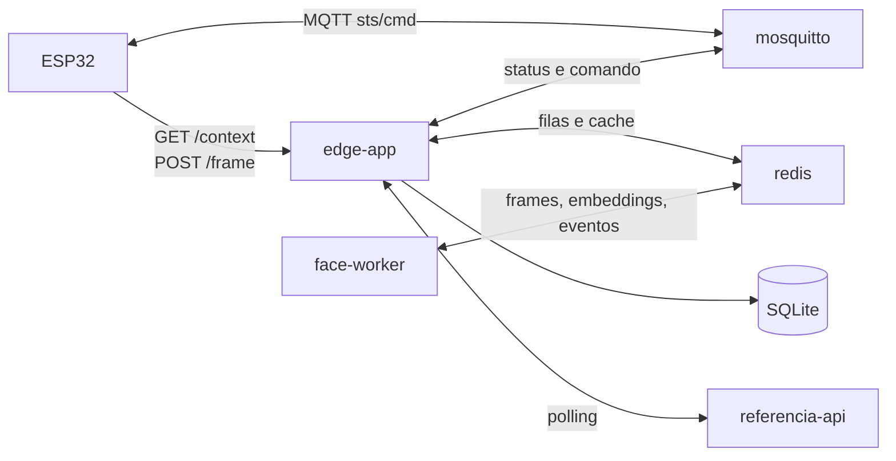
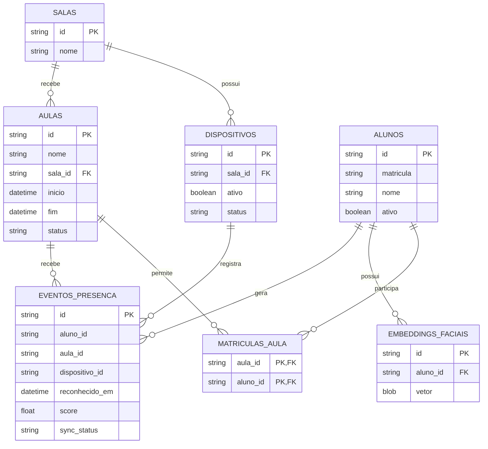
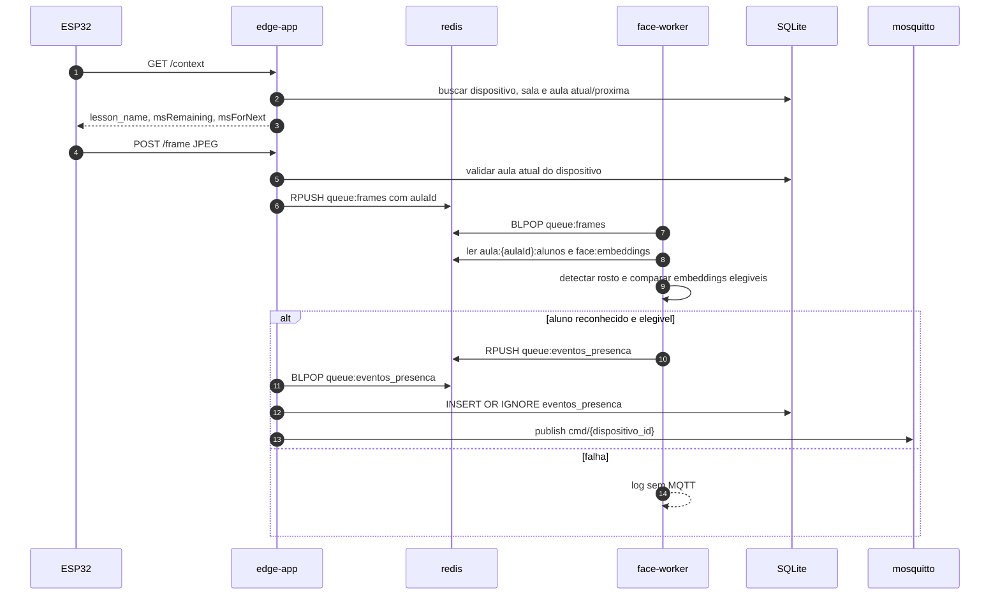
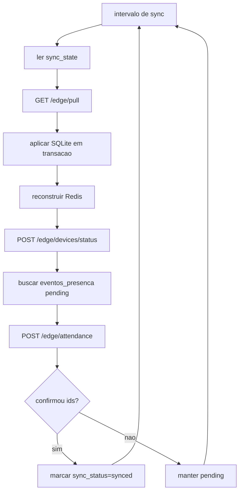

# AutoPonto Edge Node

Computacao de borda para Raspberry Pi do AutoPonto.

O node conversa com:

- ESP32 via HTTP e MQTT local;
- servidor principal via polling autenticado;
- modelos ONNX locais para deteccao e reconhecimento facial.

## Arquitetura

Containers ativos:

- `edge-app`: API HTTP, MQTT local, SQLite, sincronizacao e persistencia de presenca.
- `face-worker`: OpenCV/ONNX, reconhecimento facial e emissao de evento positivo.
- `redis`: filas e cache quente reconstruivel.
- `mosquitto`: broker MQTT local para os ESP32.



## Modelo Local

O edge nao replica o modelo academico completo da API principal. Ele guarda so o que precisa para operar offline:

- saber qual dispositivo esta em qual sala;
- descobrir a aula atual da sala;
- validar se o aluno pertence a aula;
- reconhecer rostos por embeddings;
- registrar uma presenca valida e sincronizavel.

Tabelas SQLite:

- `salas`: `id`, `nome`
- `dispositivos`: `id`, `sala_id`, `ativo`, `status`
- `aulas`: `id`, `nome`, `sala_id`, `inicio`, `fim`, `status`
- `alunos`: `id`, `matricula`, `nome`, `ativo`
- `matriculas_aula`: `aula_id`, `aluno_id`
- `embeddings_faciais`: `id`, `aluno_id`, `vetor`
- `eventos_presenca`: `id`, `aluno_id`, `aula_id`, `dispositivo_id`, `reconhecido_em`, `score`, `sync_status`
- `sync_state`: `entity`, `cursor`

`eventos_presenca` tem `UNIQUE(aluno_id, aula_id)`. Portanto, reconhecer a mesma pessoa de novo na mesma aula nao cria uma segunda presenca; o feedback usa o horario da primeira presenca.



## Redis

Redis e fila/cache, nao fonte duravel.

- `queue:frames`: frames JPEG recebidos do ESP32.
- `queue:eventos_presenca`: eventos positivos gerados pelo `face-worker`.
- `face:embeddings`: hash de embeddings por `embedding_id`.
- `aula:{aula_id}:alunos`: set de alunos elegiveis para a aula.
- `dispositivo:{dispositivo_id}:status`: ultimo status MQTT recebido.
- `dispositivos:last_seen`: hash simples de ultimo visto por dispositivo.

## API Local Para ESP32

### `GET /context`

Headers:

- `X-Device-Id`
- `X-Auth`

Resposta mantida simples para o firmware:

```json
{
  "lesson_name": "AMBIENTAL",
  "msRemaining": 6500000,
  "msForNext": 0
}
```

### `POST /frame`

Headers:

- `X-Device-Id`
- `X-Auth`
- `Content-Type: image/jpeg`

O frame so entra em `queue:frames` se existir uma aula atual para a sala do dispositivo.

Item interno da fila:

```json
{
  "dispositivoId": "dispositivo-uuid",
  "salaId": "sala-uuid",
  "aulaId": "aula-uuid",
  "receivedAt": "2026-06-18T12:00:00Z",
  "frame": "<bytes>"
}
```

## Fluxo De Presenca



Payload MQTT positivo:

```json
{
  "auth": true,
  "msg": "Daniel Silva - registrado 08:42"
}
```

Nao ha MQTT negativo. Falha de decode, sem rosto, aluno desconhecido ou aluno fora da aula atual apenas gera log.

## Sincronizacao Com A API Principal

Se `MAIN_API_URL` estiver vazio, o edge opera offline.

Autenticacao:

```http
Authorization: NodeToken <MAIN_API_TOKEN>
X-Node-Id: <NODE_ID>
```

`NODE_ID` deve ser o `NoBorda.codigo` ou o UUID do no associado ao token.

### Pull

Endpoint:

```http
GET /edge/pull?node_id=<NODE_ID>&cursors=<msgpack-hex>
```

Payload esperado:

```json
{
  "data": {
    "salas": [],
    "dispositivos": [],
    "aulas": [],
    "alunos": [],
    "matriculas_aula": [],
    "embeddings_faciais": []
  },
  "deleted": {
    "salas": [],
    "dispositivos": [],
    "aulas": [],
    "alunos": [],
    "matriculas_aula": [],
    "embeddings_faciais": []
  },
  "cursors": {
    "aulas": "2026-06-18T12:00:00Z"
  }
}
```

Campos por recurso:

- `salas`: `id`, `nome`
- `dispositivos`: `id`, `sala_id`, `ativo`, `status`
- `aulas`: `id`, `nome`, `sala_id`, `inicio`, `fim`, `status`
- `alunos`: `id`, `matricula`, `nome`, `ativo`
- `matriculas_aula`: `aula_id`, `aluno_id`
- `embeddings_faciais`: `id`, `aluno_id`, `vetor`

O edge aplica o pull em transacao SQLite e depois reconstrui o cache Redis.

### Push De Presencas

Endpoint:

```http
POST /edge/attendance
```

Payload:

```json
{
  "node_id": "NO-CCET-01",
  "eventos": [
    {
      "id": "evento-local-uuid",
      "aluno_id": "aluno-uuid",
      "aula_id": "aula-uuid",
      "dispositivo_id": "dispositivo-uuid",
      "reconhecido_em": "2026-06-18T11:42:00Z",
      "score": 0.72
    }
  ]
}
```

Resposta esperada:

```json
{
  "synced_ids": ["evento-local-uuid"]
}
```

### Push De Status Dos ESP32

O ESP32 publica localmente em `sts/{dispositivo_id}`: `offline`, `working` ou `idle`.

Endpoint:

```http
POST /edge/devices/status
```

Payload:

```json
{
  "node_id": "NO-CCET-01",
  "dispositivos": [
    {
      "dispositivo_id": "dispositivo-uuid",
      "status": "working",
      "reportado_em": "2026-06-18T11:42:00Z"
    }
  ]
}
```



## Reset De Dados Local

Use quando mudar schema local ou contrato de sync:

```bash
docker compose down -v --remove-orphans
rm -f data/db/db.sql data/db/db.sql-wal data/db/db.sql-shm
docker compose up -d --build
```

Depois do reset, os dados locais devem vir exclusivamente de `GET /edge/pull`.

## Setup

```bash
sudo apt update && sudo apt upgrade -y
curl -fsSL https://get.docker.com | sh
sudo usermod -aG docker $USER
sudo apt install docker-compose-plugin -y
sudo sysctl vm.overcommit_memory=1
```

```bash
cp .env.example .env
chmod +x scripts/init-mosquitto-password.sh
./scripts/init-mosquitto-password.sh
docker compose up -d --build
docker compose ps
```

## Modelos ONNX

```bash
wget https://github.com/opencv/opencv_zoo/raw/main/models/face_detection_yunet/face_detection_yunet_2023mar.onnx -O ./data/models/face_detection_yunet.onnx
wget https://github.com/opencv/opencv_zoo/raw/main/models/face_recognition_sface/face_recognition_sface_2021dec.onnx -O ./data/models/face_recognition_sface.onnx
```

## Mudancas Necessarias Na `referencia-api`

Arquivos principais:

- `api/services/sincronizacao_borda.py`
- `api/views/edge_contract.py`
- `api/urls.py`
- testes de integracao do contrato edge, se existirem

Alteracoes em `api/services/sincronizacao_borda.py`:

- Trocar `ENTIDADES_SYNC` para:
  - `salas`
  - `dispositivos`
  - `aulas`
  - `alunos`
  - `matriculas_aula`
  - `embeddings_faciais`
- Em `montar_payload_pull`, enviar:
  - `salas`: derivadas de `Sala`, somente `id`, `nome`;
  - `dispositivos`: derivados de `DispositivoEsp32`, somente `id`, `sala_id`, `ativo`, `status`;
  - `aulas`: derivadas de `Aula`, somente `id`, `nome`, `sala_id`, `inicio`, `fim`, `status`;
  - `alunos`: derivados de `Usuario`, somente `id`, `matricula`, `nome`, `ativo`;
  - `matriculas_aula`: projecao de `MatriculaTurma` para cada `Aula`, somente `aula_id`, `aluno_id`;
  - `embeddings_faciais`: derivados de `EmbeddingFacial`, somente `id`, `aluno_id`, `vetor`.
- Em `deleted`, usar as mesmas chaves acima.
- Em `cursors`, usar as mesmas chaves acima.
- Em `receber_presencas_borda`, trocar `events` por `eventos` e campos:
  - `student_id` -> `aluno_id`
  - `lesson_id` -> `aula_id`
  - `device_id` -> `dispositivo_id`
  - `recognized_at` -> `reconhecido_em`
- Em `atualizar_status_dispositivos_borda`, trocar `devices` por `dispositivos` e campos:
  - `device_id` -> `dispositivo_id`
  - `reported_at` -> `reportado_em`

Alteracoes em `api/views/edge_contract.py`:

- Atualizar schemas/exemplos OpenAPI para os novos nomes de payload.
- Manter autenticacao `NodeToken`.

Alteracoes em `api/urls.py`:

- Os paths podem continuar iguais:
  - `GET /edge/pull`
  - `POST /edge/attendance`
  - `POST /edge/devices/status`

O backend deve continuar validando posse do dispositivo pelo `NoBorda`, sala da aula, matricula ativa, janela `inicio/fim` e status da aula.
