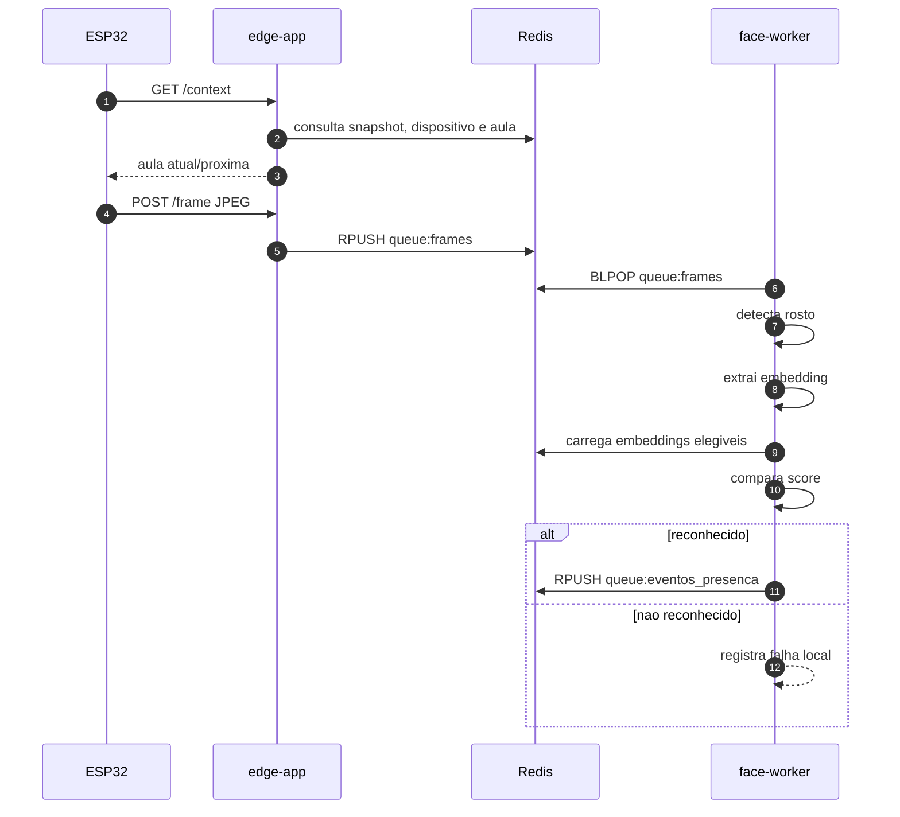
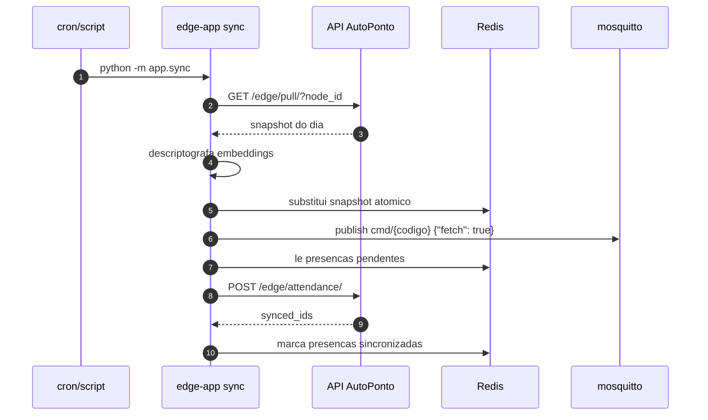
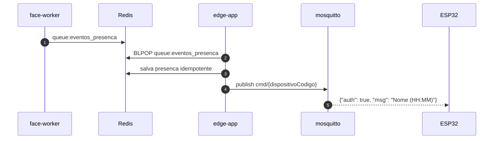
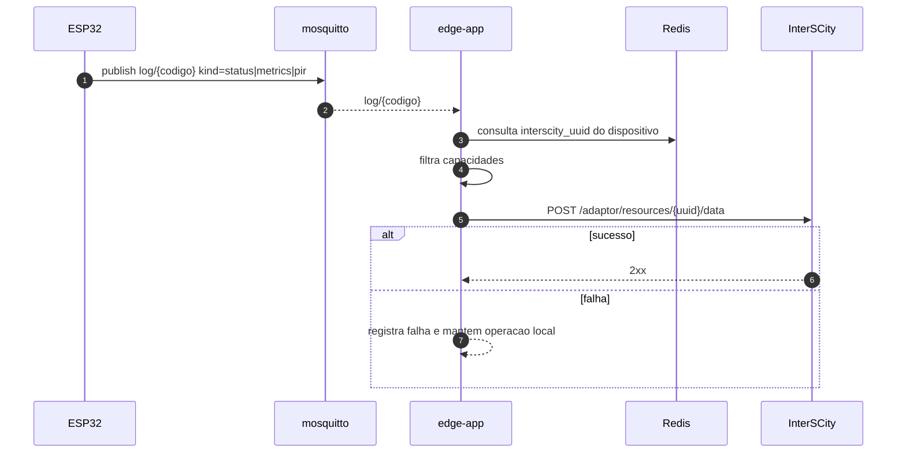

# Evidencias Para O TCC

Este documento concentra os artefatos para Metodologia e Analise dos
Resultados do EdgeNode.

## Arquivos Gerados

| Arquivo | Conteudo |
| --- | --- |
| `/data/logs/tcc/metricas_amostras.csv` | Amostras append-only das metricas de HTTP, fila, reconhecimento, sync e InterSCity. |
| `/data/logs/tcc/metricas_resumo.txt` | Resumo recalculado com quantidade, media e desvio padrao amostral quando ha valor numerico. |
| `/data/logs/metricas_avg_us.txt` | Media ponderada e desvio padrao ponderado das metricas `avg_us` do ESP32 selecionado. |
| `/data/logs/metricas_avg_us_amostras.csv` | Amostras append-only de cada captura `avg_us` recebida do ESP32 selecionado. |

## Matriz De Metricas

| Metrica | Unidade | Servico de origem | Como sera usada no TCC |
| --- | --- | --- | --- |
| `http_context_ms` | ms | `edge-app` | Medir latencia e quantidade de consultas `GET /context` feitas pelo ESP32. |
| `http_frame_ms` | ms | `edge-app` | Medir latencia e quantidade de envios `POST /frame` ate o enfileiramento. |
| `frame_espera_processamento_ms` | ms | `face-worker` | Avaliar atraso entre recebimento do frame e inicio do processamento. |
| `deteccao_facial_ms` | ms | `face-worker` | Isolar o custo da etapa de deteccao facial com YuNet. |
| `embedding_extracao_ms` | ms | `face-worker` | Isolar o custo de geracao do embedding facial com SFace. |
| `embedding_comparacao_ms` | ms | `face-worker` | Medir o custo de carregar/comparar embeddings elegiveis da aula. |
| `reconhecimento_total_ms` | ms | `face-worker` | Medir o tempo fim-a-fim do reconhecimento por frame processado. |
| `snapshot_pull_ms` | ms | `edge-app` | Medir o tempo do pull do snapshot no servidor principal. |
| `sync_falha` | evento | `edge-app` | Contabilizar falhas de pull, aplicacao de snapshot, push de presencas e fetch MQTT pos-sync. |
| `interscity_publicacao_ms` | ms | `edge-app` | Medir latencia e taxa de sucesso/falha das publicacoes no InterSCity. |
| `interscity_publicacao` | evento | `edge-app` | Contabilizar descarte por fila local cheia. |
| `avg_us.loop` | microssegundos | ESP32 via `edge-app` | Avaliar custo medio do loop principal do firmware durante o teste. |
| `avg_us.mqtt` | microssegundos | ESP32 via `edge-app` | Avaliar custo medio das rotinas MQTT no firmware. |
| `avg_us.network` | microssegundos | ESP32 via `edge-app` | Avaliar custo medio das rotinas de rede no firmware. |
| `avg_us.camera` | microssegundos | ESP32 via `edge-app` | Avaliar custo medio de captura/processamento local de camera. |
| `avg_us.display` | microssegundos | ESP32 via `edge-app` | Avaliar custo medio de atualizacao do display. |

Notas:

- O resumo geral usa desvio padrao amostral das amostras numericas registradas.
- As metricas `avg_us` usam media ponderada por `avg_count`.
- O desvio padrao de `avg_us` e ponderado entre capturas recebidas; ele nao
  representa variancia interna de cada lote do firmware, porque o ESP32 envia
  media e contagem, nao a variancia bruta.

## Arquitetura Do EdgeNode

```mermaid
flowchart LR
  ESP32[ESP32] -->|GET /context<br/>POST /frame| EdgeApp[edge-app]
  ESP32 <-->|log/{codigo}<br/>cmd/{codigo}| Mosquitto[mosquitto]
  Mosquitto -->|logs por kind| EdgeApp
  EdgeApp <-->|snapshot, filas, presencas| Redis[redis]
  FaceWorker[face-worker] <-->|frames, embeddings, eventos| Redis
  EdgeApp <-->|pull snapshot<br/>push presencas| AutoPonto[API AutoPonto]
  EdgeApp -->|telemetria| InterSCity[Resource Adaptor InterSCity]
```

## Fluxo De Reconhecimento



## Fluxo De Sincronizacao



## Fluxo MQTT De Feedback



## Fluxo De Telemetria InterSCity


